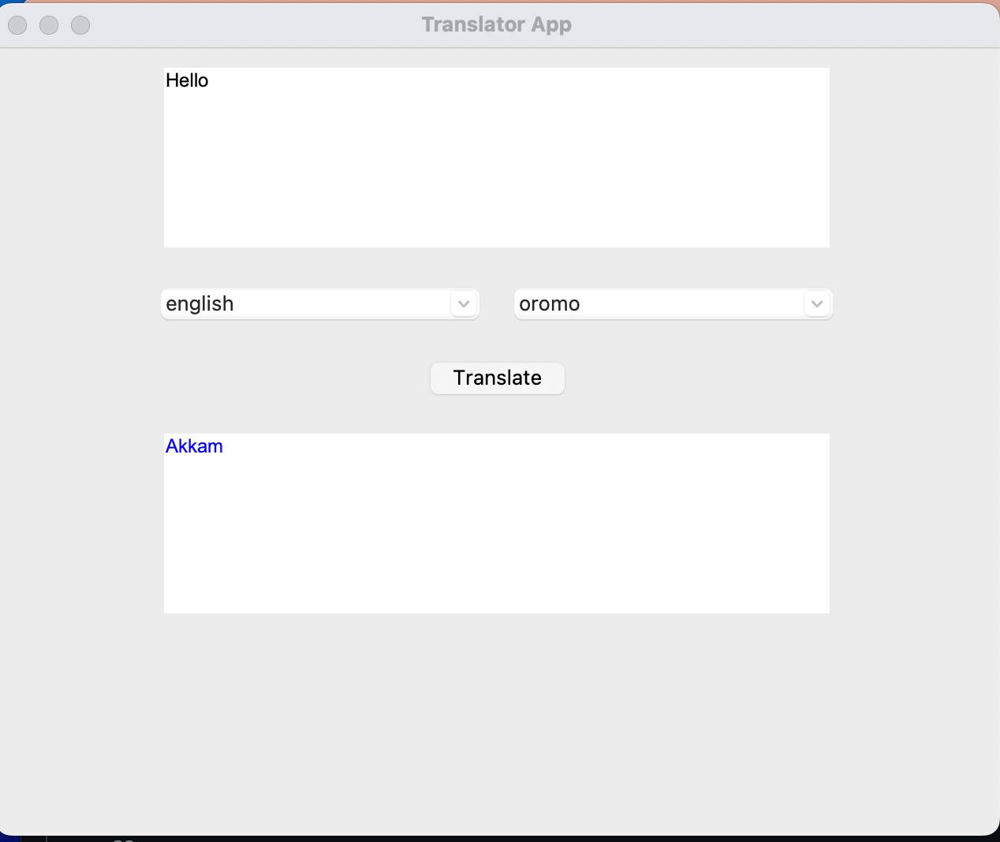

Absolutely! Here's a clean and clear `README.md` file for your GitHub repo:

---

```markdown
# 🈯 Language Translator App

A simple yet fun language translator desktop app built with **Python** and **Tkinter**, using the powerful `deep_translator` package under the hood (Google Translate API).

## ✨ Features

- 🌍 Translate between **100+ languages**
- 🌐 Includes **Afaan Oromo**, **Amharic**, **English**, **French**, **Arabic**, and more
- 🧠 Clean and intuitive GUI with `tkinter`
- 🎨 Works cross-platform (tested on macOS)

## 📸 Screenshot



## 🚀 How to Run

1. **Clone the repo**

```bash
git clone https://github.com/benasphy/Language_Translator
cd Language_Translator
```

2. **Install the required package**

```bash
pip install deep-translator
```

3. **Run the app**

```bash
python translator.py
```

## 🧪 Example

Translate from:

- **English → Afaan Oromo**
- **Oromo → Amharic**
- **Amharic → English**
- …and pretty much anything else!

## 📦 Dependencies

- `tkinter` – GUI
- `deep-translator` – for Google Translate API access

Install with:

```bash
pip install deep-translator
```

## 😄 Why I Built This

Sometimes you don’t need a reason. I just thought:
> "Hey, wouldn't it be fun to build a translator app today?"  
…and then I did it.


Have fun with it, and feel free to fork, star ⭐, or break it! 😄
